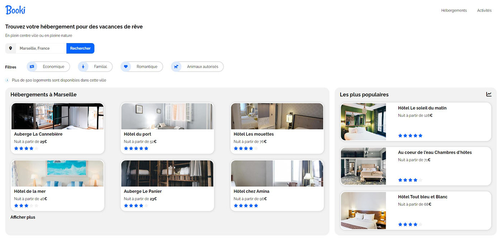

# Booki: responsive website homepage for a housing rentals booking company

<!-- PROJECT SHIELDS -->
<!--
*** This template uses markdown "reference style" links for readability.
*** Reference links are enclosed in brackets [ ] instead of parentheses ( ).
*** See the bottom of this document for the declaration of the reference variables
*** for contributors-url, forks-url, etc. This is an optional, concise syntax you may use.
*** https://www.markdownguide.org/basic-syntax/#reference-style-links
-->

[![Contributors][contributors-shield]][contributors-url] [![Forks][forks-shield]][forks-url] [![Stargazers][stars-shield]][stars-url] [![Issues][issues-shield]][issues-url]

<!-- ABOUT THE PROJECT -->

## About The Project



This project is a responsive website homepage for a housing rentals booking company, made as a student project.

It was made from these mockups:

- [desktop](project/mockup-desktop.png)
- [smartphone](project/mockup-smartphone.png)

The requirements were:

- Use of HTML/CSS
- Desktop-first responsivity
- 992 px and 768 px breakpoints
- Font Awesome icons, use of a CDN
- Use of Raleway Google Font
- Use of pixels and percentages, not em neither rem
- Use of Flexbox
- Forbidding of a CSS framework as Bootstrap and of a preprocessor as Sass
- Has to be W3C valid

You can have a look on this website homepage here:
https://csimon-web.github.io/booki/

### Built With

- HTML 5, CSS 3
- Git
- VS Code

<!-- GETTING STARTED -->

## Getting Started

To get a local and running copy, please follow these simple steps.

### Prerequisites

- Git

### Installation

1. Clone the repo

```sh
git clone https://github.com/csimon-web/booki.git
```

2. Open index.html in your favorite internet browser

<!-- USAGE EXAMPLES -->
<!--## Usage

Use this space to show useful examples of how a project can be used. Additional screenshots, code examples and demos work well in this space. You may also link to more resources.

_For more examples, please refer to the [Documentation](https://example.com)_-->

<!-- CONTACT -->

## Contact

Christophe Simon, [personnal website](https://www.csimon.info)

Project Link: [https://github.com/csimon-web/booki](https://github.com/csimon-web/booki)

<!-- ACKNOWLEDGEMENTS -->

## Acknowledgements

- This readme version is a customized version of this [github repository](https://github.com/NicolasBrondin/basic-readme-template) by NicolasBrondin

<!-- MARKDOWN LINKS & IMAGES -->
<!-- https://www.markdownguide.org/basic-syntax/#reference-style-links -->

[contributors-shield]: https://img.shields.io/github/contributors/csimon-web/booki.svg?style=flat-square
[contributors-url]: https://github.com/csimon-web/booki/graphs/contributors
[forks-shield]: https://img.shields.io/github/forks/csimon-web/booki.svg?style=flat-square
[forks-url]: https://github.com/csimon-web/booki/network/members
[stars-shield]: https://img.shields.io/github/stars/csimon-web/booki.svg?style=flat-square
[stars-url]: https://github.com/csimon-web/booki/stargazers
[issues-shield]: https://img.shields.io/github/issues/csimon-web/booki.svg?style=flat-square
[issues-url]: https://github.com/csimon-web/booki/issues
[license-shield]: https://img.shields.io/github/license/csimon-web/booki.svg?style=flat-square
[license-url]: https://github.com/csimon-web/booki/blob/master/LICENSE.txt
