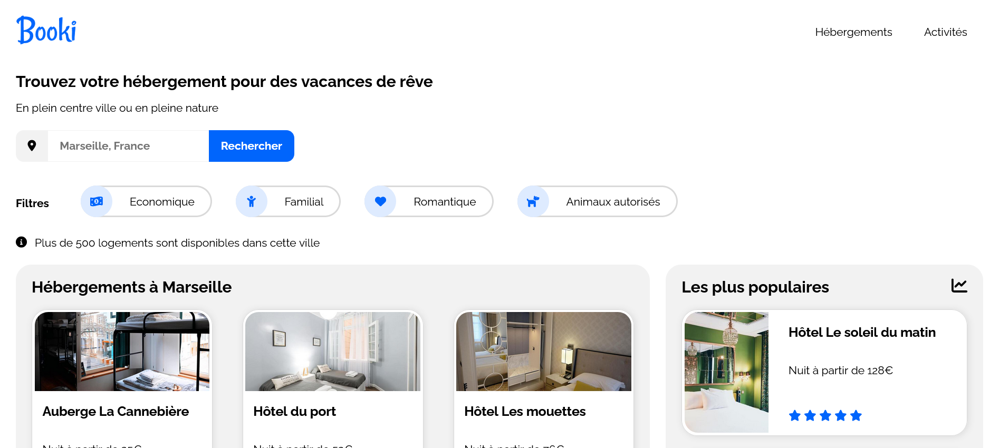

# Responsive website homepage for a housing rentals booking company

<!-- ABOUT THE PROJECT -->
## About The Project



This project is a responsive website homepage for a housing rentals booking company, made as a student project.

It was made from these mockups:
- [desktop](project/Mockup-desktop.png)
- [smartphone](project/Mockup-smartphone.png)

The requirements were:
- Use of html/css
- Desktop-first responsivity
- 992 px and 768 px breakpoints
- Font Awesome icons, use of a cdn
- Use of Raleway Google Font
- Use of pixels and percentages, not em neither rem
- Use of flexbox
- Forbidding of a css framework as Bootstrap and of a preprocessor as Sass
- Has to be w3c valid

You can have a look on this website homepage here:
https://christophe-simon.github.io/booki/

### Built With

* Markdown, Html, Css
* Git, Github
* VS Code
* Love

<!-- GETTING STARTED -->
## Getting Started

To get a local and running copy, please follow these simple steps.

### Prerequisites

* Git
```sh
sudo apt-get install git
```

### Installation
 
1. Clone the repo
```sh
git clone https://github.com/christophe-simon/booki
```
2. Open index.html in your favorite internet browser


<!-- USAGE EXAMPLES -->
<!--## Usage

Use this space to show useful examples of how a project can be used. Additional screenshots, code examples and demos work well in this space. You may also link to more resources.

_For more examples, please refer to the [Documentation](https://example.com)_-->


<!-- CONTACT -->
## Contact

Christophe Simon, [personnal website](https://www.csimon.info)

Project Link: [https://github.com/christophe-simon/booki](https://github.com/christophe-simon/booki)


<!-- ACKNOWLEDGEMENTS -->
## Acknowledgements

* This readme version is a simplified version of this [github repository](https://github.com/othneildrew/Best-README-Template) by Othneildrew
* This readme version is a customized version of this [github repository](https://github.com/NicolasBrondin/basic-readme-template) by NicolasBrondin